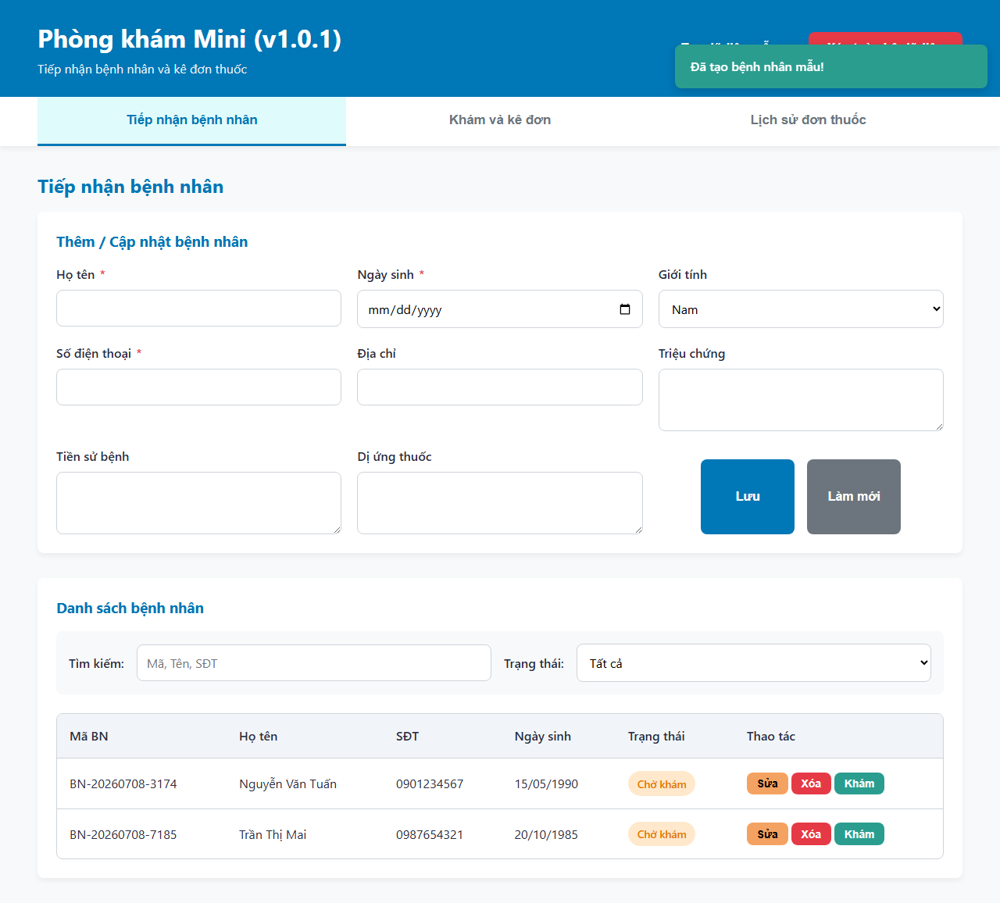
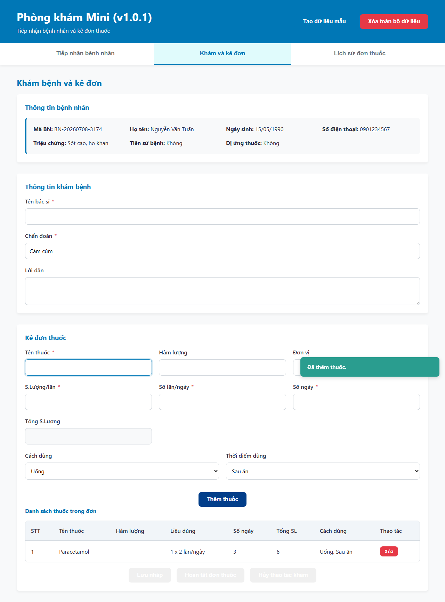

# Phòng Khám Mini

**⚠️ CẢNH BÁO QUAN TRỌNG:**

- Đây là ứng dụng **mục đích học tập**.
- **Tuyệt đối không sử dụng** cho hoạt động khám chữa bệnh thực tế.
- **Không lưu dữ liệu bệnh nhân thật**.
- **Không nhập thông tin sức khỏe thật** lên môi trường public (như GitHub Pages).

---

## 26. Link demo

👉 \[Link demo GitHub Pages\] *(Sinh viên điền link tại đây)*

## 27. Link repository

👉 \[Link GitHub Repository\] *(Sinh viên điền link tại đây)*

---

## 28. Ảnh chụp màn hình



---

## 1. Giới thiệu dự án

Phòng khám Mini là một ứng dụng Web (Single Page Application - SPA) hỗ trợ quản lý bệnh nhân, khám bệnh và kê đơn thuốc. Dự án được thiết kế dưới dạng không có Backend (Serverless Frontend), sử dụng LocalStorage để lưu trữ dữ liệu hoàn toàn trên trình duyệt.

## 2. Mục tiêu học tập

Dự án được xây dựng nhằm mục đích giúp sinh viên thực hành:

- Xây dựng ứng dụng Vanilla JavaScript thuần túy không dùng Framework (React/Vue/Angular).
- Hiểu về kiến trúc nhiều tầng: UI, Service, Business, Repository, Utilities.
- Làm quen với Dependency Injection trong JavaScript.
- Kỹ năng viết Unit Test và Business Test với Vitest.
- Kỹ năng viết End-to-End (E2E) Test với Playwright.
- Thiết lập quy trình CI/CD hoàn chỉnh trên GitHub Actions và deploy tự động lên GitHub Pages.

## 3. Các chức năng

- **Tiếp nhận bệnh nhân:** Thêm mới, cập nhật, tìm kiếm, lọc trạng thái, và xóa bệnh nhân.
- **Khám và kê đơn:** Tạo đơn thuốc nháp, thêm thuốc, xóa thuốc, tính tổng số lượng thuốc.
- **Lịch sử đơn thuốc:** Xem danh sách đơn thuốc, xem chi tiết, và hủy đơn thuốc nháp.

## 4. Công nghệ sử dụng

- **Cốt lõi:** HTML5, CSS3, Vanilla JavaScript (ES Modules).
- **Build Tool:** Vite.
- **Unit/Business Test:** Vitest.
- **E2E Test:** Playwright.
- **CI/CD:** GitHub Actions.
- **Hosting:** GitHub Pages.

## 5. Cấu trúc thư mục

```text
/patient-prescription-ai
├── .github/workflows/   # File CI/CD pipeline
├── src/
│   ├── css/             # Stylesheet
│   ├── js/
│   │   ├── business/    # Các quy tắc nghiệp vụ (Pure Functions)
│   │   ├── constants/   # Khai báo hằng số
│   │   ├── repositories/# Xử lý đọc/ghi LocalStorage
│   │   ├── services/    # Logic phối hợp các tầng và xử lý nghiệp vụ
│   │   ├── ui/          # Quản lý DOM và Event Listener
│   │   └── utils/       # Hàm tiện ích (mã, kiểm tra, ngày tháng)
│   └── main.js          # Khởi tạo ứng dụng & Dependency Injection
├── tests/
│   ├── business/        # Business Test (Vitest)
│   ├── e2e/             # UI/E2E Test (Playwright)
│   └── unit/            # Unit Test (Vitest)
├── index.html           # Trang giao diện chính
├── package.json         # Khai báo script và dependency
└── vite.config.js       # Cấu hình Vite
```

## 6. Mô hình dữ liệu bệnh nhân

```javascript
{
  id: "chuỗi-duy-nhất",
  maBenhNhan: "BN-YYYYMMDD-XXXX",
  hoTen: "Nguyễn Văn A",
  ngaySinh: "1990-01-01",
  gioiTinh: "nam",
  soDienThoai: "0901234567",
  diaChi: "Hà Nội",
  trieuChung: "Sốt",
  tienSuBenh: "Không",
  diUngThuoc: "Không",
  trangThai: "cho_kham" | "dang_kham" | "da_kham"
}
```

## 7. Mô hình dữ liệu đơn thuốc

```javascript
{
  id: "chuỗi-duy-nhất",
  maDonThuoc: "DT-YYYYMMDD-XXXX",
  benhNhanId: "id-bệnh-nhân",
  tenBacSi: "Bác sĩ B",
  chuanDoan: "Sốt siêu vi",
  loiDan: "Uống nhiều nước",
  trangThai: "nhap" | "da_hoan_tat" | "da_huy",
  danhSachThuoc: [
    {
      id: "chuỗi-duy-nhất",
      tenThuoc: "Paracetamol",
      hamLuong: "500mg",
      donVi: "Viên",
      soLuongMoiLan: 1,
      soLanMoiNgay: 2,
      soNgayDung: 5,
      tongSoLuong: 10,
      cachDung: "Uống",
      thoiDiemDung: "Sau ăn"
    }
  ],
  thoiGianTao: "ISO String",
  thoiGianCapNhat: "ISO String"
}
```

## 8. Các quy tắc nghiệp vụ

- **Mã tự động:** Mã BN dạng `BN-YYYYMMDD-XXXX`, mã ĐT dạng `DT-YYYYMMDD-XXXX`.
- **Logic bệnh nhân:** Ngày sinh không được ở tương lai. Bệnh nhân trùng (cùng SĐT + Ngày sinh) bị cảnh báo. Bệnh nhân đã có đơn thuốc "Hoàn tất" thì không thể xóa.
- **Logic khám bệnh:** Bệnh nhân phải "Chờ khám" mới tạo được đơn nháp. Tổng số lượng thuốc = Số lượng 1 lần × Số lần/ngày × Số ngày. Không được điền số lượng &lt;= 0.
- **Logic đơn thuốc:** Đơn đã "Hoàn tất" không thể sửa hoặc hủy. Khi hủy đơn, bệnh nhân quay về trạng thái "Chờ khám".

## 9. Hướng dẫn cài Node.js

1. Truy cập [nodejs.org](https://nodejs.org/).
2. Tải và cài đặt phiên bản **LTS** (Long Term Support).
3. Mở terminal, kiểm tra cài đặt bằng lệnh: `node -v` và `npm -v`.

## 10. Hướng dẫn clone dự án

Mở terminal và chạy lệnh:

```bash
git clone <link-repository-của-bạn>
cd patient-prescription-ai
```

## 11. Hướng dẫn cài dependency

Sử dụng `npm ci` (Clean Install) để cài đặt chính xác các thư viện ghi trong file `package-lock.json`:

```bash
npm ci
```

## 12. Hướng dẫn chạy local

Khởi chạy web server cho môi trường phát triển:

```bash
npm run dev
```

Trình duyệt sẽ hiển thị ứng dụng tại địa chỉ (ví dụ: `http://localhost:5173`).

## 13. Hướng dẫn chạy Unit Test

Chạy tập lệnh kiểm thử mức đơn vị (kiểm tra các hàm utils độc lập):

```bash
npm run test:unit
```

## 14. Hướng dẫn chạy Business Test

Chạy tập lệnh kiểm thử mức nghiệp vụ (không chạm DOM):

```bash
npm run test:business
```

## 15. Hướng dẫn xem coverage

Chạy báo cáo độ phủ mã nguồn (Code Coverage):

```bash
npm run test:coverage
```

## 16. Hướng dẫn chạy Playwright

Kiểm thử Giao diện/End-to-End (E2E) tự động bằng Playwright:

```bash
npm run test:e2e
```

## 17. Hướng dẫn xem Playwright report

Sau khi chạy E2E test, xem báo cáo chi tiết trực quan:

```bash
npm run test:e2e:report
```

## 18. Hướng dẫn build

Đóng gói dự án (tối ưu hóa HTML, CSS, JS) cho production:

```bash
npm run build
```

Mã nguồn đã biên dịch sẽ nằm trong thư mục `dist/`.

## 19. Hướng dẫn đẩy source code lên GitHub

1. Thêm các file thay đổi: `git add .`
2. Commit: `git commit -m "Hoàn thiện dự án"`
3. Push code: `git push origin main`

## 20. Hướng dẫn bật GitHub Pages

1. Vào mục **Settings** của Repository trên GitHub.
2. Chọn phần **Pages** ở thanh menu bên trái.
3. Dưới mục **Build and deployment** -&gt; **Source**, chọn **GitHub Actions**.
4. GitHub sẽ tự động tìm cấu hình `.github/workflows/ci-cd.yml` và kích hoạt deploy.

## 21. Giải thích pipeline CI/CD

File `.github/workflows/ci-cd.yml` thực thi các job sau khi có push hoặc pull_request vào nhánh `main`:

- **Job Test:** Checkout code, cài Node.js, `npm ci`, tự động chạy Unit Test, Business Test, tạo báo cáo Coverage và chạy Playwright UI Test.
- **Job Build:** Đóng gói code thành artifact.
- **Job Deploy:** (Chỉ chạy trên nhánh `main` và khi Test pass) Deploy tự động thư mục `dist` lên GitHub Pages.

## 22. Giải thích dữ liệu LocalStorage

Ứng dụng ghi dữ liệu hoàn toàn trên bộ nhớ trình duyệt người dùng với 3 key chính:

- `pk_benh_nhan`: Mảng chứa thông tin bệnh nhân.
- `pk_don_thuoc`: Mảng chứa danh sách đơn thuốc.
- `pk_phien_ban`: Quản lý version cấu trúc dữ liệu nếu sau này có nâng cấp.

## 23. Cách xóa dữ liệu ứng dụng

- **Từ giao diện:** Chuyển qua tab "Tiếp nhận bệnh nhân" hoặc "Lịch sử đơn thuốc", bấm nút **Xóa toàn bộ dữ liệu hệ thống**.
- **Từ Developer Tools:** Nhấn `F12` -&gt; tab `Application` -&gt; `Local Storage` -&gt; Chuột phải và chọn `Clear`.

## 24. Các hạn chế của phiên bản học tập

- **Bảo mật:** Dữ liệu hoàn toàn lưu tại thiết bị, không chia sẻ đa nền tảng và dễ bị chỉnh sửa. Dữ liệu sẽ mất khi người dùng dọn dẹp browser.
- **Bảo mật sức khỏe:** Không dùng cơ chế mã hóa, không đạt chuẩn HIPAA (Mỹ) hay bảo vệ thông tin sức khỏe theo quy định hiện hành.
- **UX:** Chưa có tính năng tra cứu tên thuốc có sẵn, chưa hỗ trợ In hóa đơn, không có phân quyền Bác sĩ/Lễ tân.

## 25. Checklist nộp bài

- [ ] Điền link Demo và link Repo ở đầu file README.

- [ ] Chèn ảnh chụp màn hình chạy thực tế ứng dụng.

- [ ] Push toàn bộ source code lên GitHub (kiểm tra trạng thái GitHub Actions chuyển sang màu Xanh - Pass).

- [ ] Truy cập đường dẫn GitHub Pages để kiểm tra demo online chạy tốt không.

- [ ] Gửi link repository hoặc upload nén theo quy định của môn học.